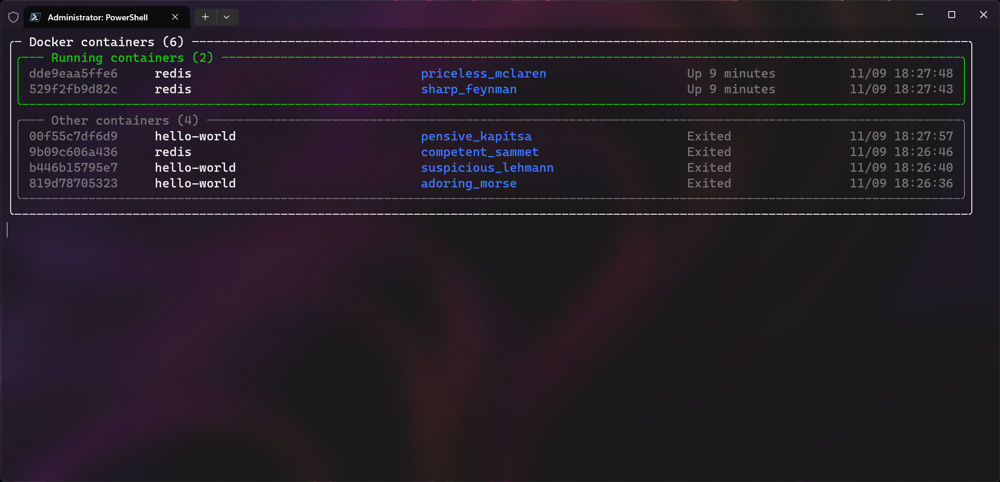

# Docker Status

### Description
A simple command line tool to monitor docker images on your machine.

### Reason
This is a built-in functionality in Docker Desktop. However, Docker Desktop
is not a free software in some corporate use-cases.
The recommended replacement - Rancher Desktop (which is free) - is not equipped with
container monitoring capability.

### Screenshots

